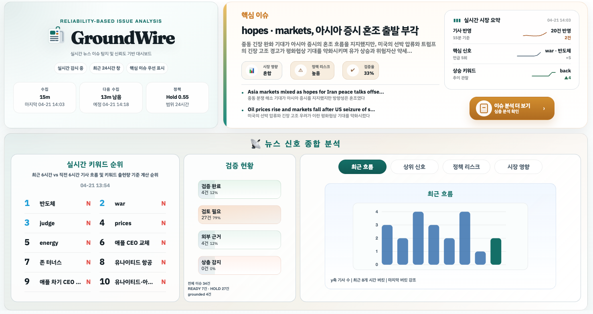
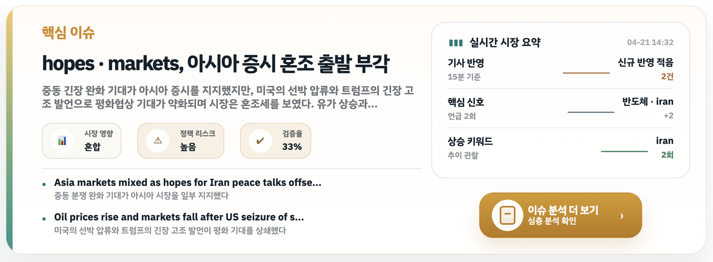
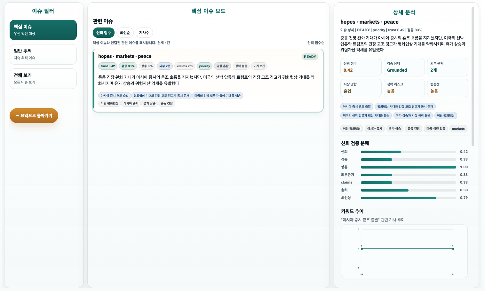
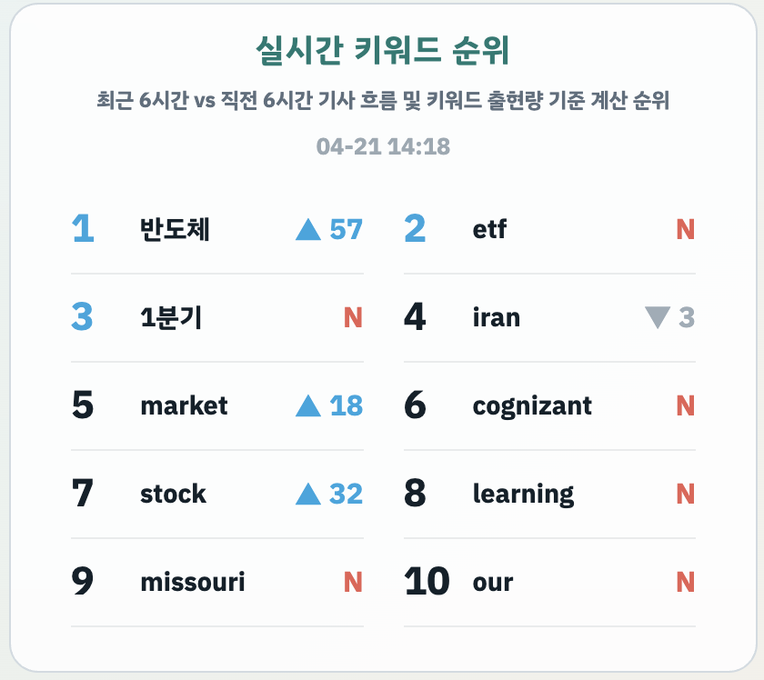

# GroundWire
## **Trust-First Real-Time News Issue Analysis Dashboard**

GroundWire는 실시간 뉴스 데이터를 기반으로, **검토 가능한 이슈만 선별해 구조화하는 분석 대시보드**입니다.

**근거 기반 검증 + 신뢰도 평가 + LLM 분석**을 통해  
이슈를 `READY` / `HOLD` 상태로 분류합니다.

---

## 📊 Demo

### Main Dashboard Overview
실시간 뉴스 수집 상태와 핵심 이슈 요약을 한눈에 확인

---

### Core Issue & Market Summary
이슈 단위로 요약된 뉴스와 시장 영향 분석 제공

---

### Issue Board & Detailed Analysis
이슈별 신뢰도, 근거, 검증 상태를 기반으로 분석 결과 제공

---

### Keyword Trends & Signals
실시간 키워드 흐름과 뉴스 신호 변화 분석

---

## 🚀 핵심 기능

- 실시간 RSS 기반 뉴스 수집
- 기사 정제 및 저품질 / 중복 제거
- 유사 기사 클러스터링 → 이슈 단위 분석
- **RAG 기반 근거(evidence) 수집**
- **신뢰도 기반 필터링**
- **LLM + grounding 기반 분석**
- `READY` / `HOLD` 판정
- 웹 대시보드 시각화

---

## 🌟 핵심 컨셉

> **"확인 가능한 이슈만 보여준다"**

LLM이 생성한 결과를 그대로 사용하지 않습니다.  
각 claim에 대해 **support / contradiction을 검증**하고,  
근거 기반으로 다시 필터링합니다.

---

## 🛠 기술 스택

---

## 📂 프로젝트 구조

app/
  config.py
  main.py
  models.py
  repository.py
  services/
    collection.py
    crawling.py
    preprocessing.py
    pipeline.py
    rag.py
    reliability.py
    llm_analyzer.py
templates/
  dashboard.html
static/
tests/
news_agent.db

---

## ⚙️ 실행 방법

### 1. 저장소 클론

git clone <repository-url>
cd "New project"

### 2. 가상환경

python3 -m venv .venv
source .venv/bin/activate

### 3. 의존성 설치

pip install -r requirements.txt

### 4. 환경 변수

OPENAI_API_KEY=your_api_key_here
OPENAI_MODEL=gpt-5.4-mini
EMBEDDING_MODEL=text-embedding-3-small
ENABLE_SCHEDULER=true

### 5. 실행

python -m uvicorn app.main:app --reload --host 127.0.0.1 --port 8000

---

## 🎛 모드 설정

PRESENTATION_MODE=true
HOLD_THRESHOLD=0.55
MIN_ARTICLES_PER_ISSUE=1
MIN_UNIQUE_SOURCES=1

---

## ⚠️ 한계점

- Google News 구조 변경 시 URL 복원 로직 영향 가능
- clustering 특성상 단일 기사 이슈 발생 가능
- 일부 테스트 데이터가 DB에 남아 있을 수 있음
- 프론트 구조는 단일 템플릿 기반으로 확장성 제한 존재

---

## 📌 참고할 사항

- 현재 프론트는 `dashboard.html` 단일 구조
- 배포 직전에는 구조 분리보다 **안정성 유지가 우선**
- 이후 리팩터링 시 HTML / CSS / JS 분리 권장

---

## 🧾 요약

GroundWire는  
**실시간 뉴스 → 이슈 단위 구조화 → 근거 기반 검증 → 신뢰도 판정**까지 이어지는

**Trust-first 뉴스 분석 시스템**입니다.
